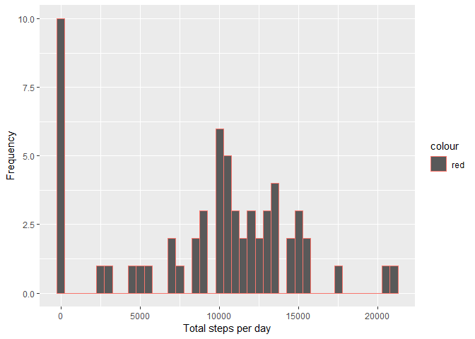
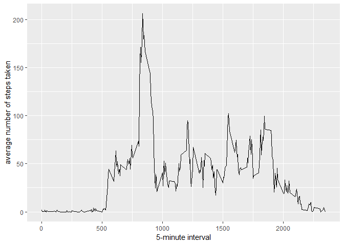
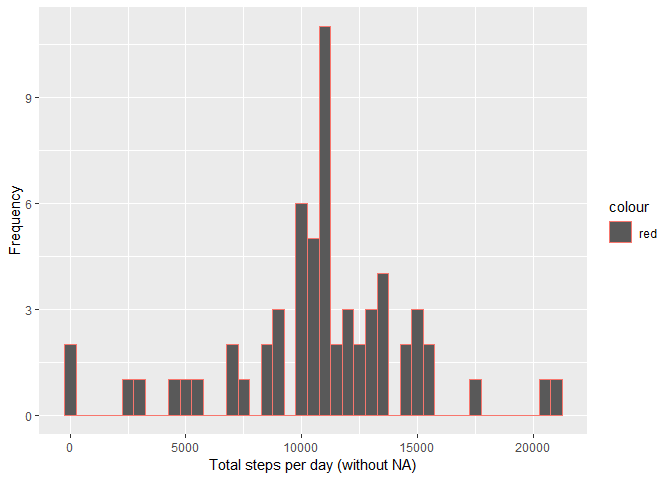
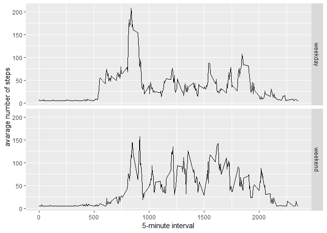

```r
library(ggplot2)
```

```
## Warning: package 'ggplot2' was built under R version 3.5.1
```

```r
library(scales)
library(Hmisc)
```

```
## Warning: package 'Hmisc' was built under R version 3.5.1
```

```
## Loading required package: lattice
```

```
## Loading required package: survival
```

```
## Loading required package: Formula
```

```
## 
## Attaching package: 'Hmisc'
```

```
## The following objects are masked from 'package:base':
## 
##     format.pval, units
```


## Loading and preprocessing the data

```r
if(!file.exists('activity.csv')){
    unzip('activity.zip')
}
activity <- read.csv('activity.csv')
```


## What is mean total number of steps taken per day?
1. the total steps per day 

```r
TotalStepsPerDay<- tapply(activity$steps,activity$date, sum, na.rm=T)
```
2. histogram for the total number of steps taken each day

```r
qplot(TotalStepsPerDay,xlab='Total steps per day', ylab='Frequency', binwidth=500,col="red")
```

<!-- -->
3. the mean and median of the steps for each day

```r
MeanStepsPerDay= mean(TotalStepsPerDay)
MedianStepsPerDay= median(TotalStepsPerDay)
```


## What is the average daily activity pattern?
1. mean steps per day 
##### it must be aggregated by the interval because day might have been occured more than one time

```r
AverageStepsPerDay<- aggregate(x=list(steps=activity$steps),by=list(interval=activity$interval),
                               FUN=mean, na.rm=TRUE)
```
2. the time series plot

```r
ggplot(data=AverageStepsPerDay, aes(x=interval, y=steps)) +
    geom_line() +
    xlab("5-minute interval") +
    ylab("average number of steps taken")
```

<!-- -->
3. the maximum number of steps by the 5-minute interval

```r
MaxNumberOfSteps <- which.max(AverageStepsPerDay$steps)
timeOfMaxSteps <-  gsub("([0-9]{1,2})([0-9]{2})", "\\1:\\2", AverageStepsPerDay[MaxNumberOfSteps,'interval'])
```


## Imputing missing values
1. the total number of missing values

```r
NumberOfMissingValues<- length(which(is.na(activity$steps)))
```
2. my strategy would be filling the missing values spaces with the mean of the steps 
3. creating a new dataset with replaced missing values by the mean number of steps 

```r
activityDataWithoutNA <- activity
activityDataWithoutNA$steps <- impute(activity$steps, fun=mean)
```
4. histogram for the total number of steps taken each day but with no missing values

```r
TotalStepsPerDayWithoutNA <- tapply(activityDataWithoutNA$steps, activityDataWithoutNA$date, sum)
qplot(TotalStepsPerDayWithoutNA, xlab='Total steps per day (without NA)', ylab='Frequency', binwidth=500,col="red")
```

<!-- -->
#### the mean and median of the steps for each day

```r
stepsByDayMeanWithoutNA<- mean(TotalStepsPerDayWithoutNA)
stepsByDayMedianWithoutNA <- median(TotalStepsPerDayWithoutNA)
```
#### we notice that filling the empty spaces increases trhe values of mean and median 


## Are there differences in activity patterns between weekdays and weekends?
1. factorizing days between weekday or weekind by mutating a new column

```r
activityDataWithoutNA$DayType <-  ifelse(as.POSIXlt(activityDataWithoutNA$date)$wday %in% c(0,6), 'weekend', 'weekday')
```
2. Makeing a panel plot containing a time series plot

```r
AverageStepsPerDayWithoutNA <- aggregate(steps ~ interval + DayType, data=activityDataWithoutNA, mean)
ggplot(AverageStepsPerDayWithoutNA, aes(interval, steps)) + 
    geom_line() + 
    facet_grid(DayType ~ .) +
    xlab("5-minute interval") + 
    ylab("avarage number of steps")
```

<!-- -->

